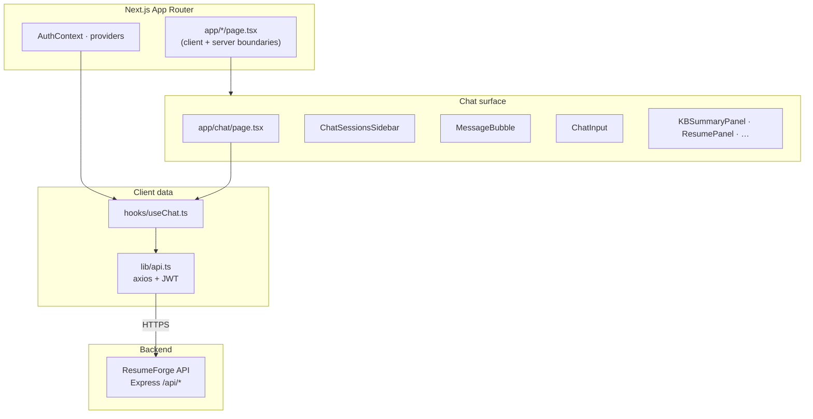
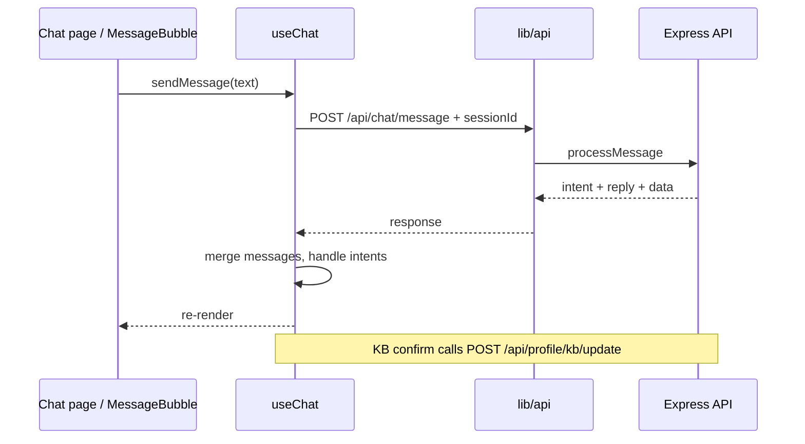

<div align="center">

# ResumeForge Web

### Next.js client for AI chat, knowledge base, resumes, and interview practice

[](https://nextjs.org)
[](https://react.dev)
[](https://www.typescriptlang.org)
[](https://tailwindcss.com)
[](https://firebase.google.com)

> A **Next.js 14 (App Router)** front end: multi-session **agent-style chat**, tabbed **activity** tools, **resizable** three-column layout, **rich message cards** (diffs, resume changes, job cards), and a **Web Speech**-based **interview coach** — all calling the ResumeForge API with **Firebase ID tokens**.

[Problem & solution](#the-problem) • [Architecture](#architecture) • [State & data flow](#state--data-flow) • [Features ↔ code](#feature-to-implementation) • [Routes](#app-router-routes) • [Packages](#key-dependencies) • [Config & security](#configuration--security) • [Quick start](#quick-start)

</div>

---

## The problem

Typical “AI resume” products either:

- Chat in a **single** thread with no durable **session** model  
- Show **wall-of-text** responses with no **before/after** for KB or resume changes  
- Use a **fixed** layout that wastes space for sessions vs. tools  
- Offload “interview practice” to a **separate** product with no link to the same **KB + JD** the user already has here  

---

## The solution

This app provides:

1. **Per-chat sessions** — list, create, delete, auto-title from first message (`ChatSessionsSidebar` + `/api/chat/sessions*`).  
2. **Three-column workspace** — **react-resizable-panels** v4 (`Group` / `Panel` / `Separator`) with **persisted layout** via `useDefaultLayout` (localStorage, id `rf-chat-layout`).  
3. **Trust surfaces** — `DiffCard` for KB patches; `ResumeDiffCard` when a new tailored resume differs from the previous session snapshot; toasts on API errors.  
4. **Interview prep** — server-generated question sets in the right tab, plus embedded **`InterviewCoachPractice`** (TT / TV / VT / VV) and a full-page **`/interview/coach`**.  
5. **Auth-aware API client** — Axios instance injects `Authorization: Bearer <ID token>` and redirects on **401** (`lib/api.ts`).

---

## Features (product)

| Area | What the user gets |
|------|-------------------|
| **Chat** | Markdown assistant replies, intent chips, continuations for group/peer flows |
| **KB** | Summary panel, import JSON (settings), diff + confirm for `update_kb` |
| **Resume** | Live preview, ATS, cover letter hooks, **full preview** in `/chat/resume-full` (print-friendly) |
| **Group** | Invites, bulk update flows driven from chat continuations |
| **Interview** | General + role-specific questions; **voice coach** in-tab and standalone |
| **Applications** | Tracker-style panel tied to API |
| **Jobs** | Explorer / search integration where configured |

---

## Architecture

### Browser layers



### API base URL resolution

`lib/api.ts`:

- If **`NEXT_PUBLIC_API_URL`** is set → Axios `baseURL` is that origin (e.g. `https://api.example.com` or `http://localhost:4000`).  
- If **unset** → `baseURL` is **empty** → requests are **same-origin** (browser calls `/api/...` on the Next host). **You must** configure your deployment (reverse proxy, separate API host, or rewrites) so those requests reach the Express API.

> The repo’s `next.config.mjs` sets **COOP** headers (`same-origin-allow-popups`) for Firebase Auth popups — not API routing.

---

## State & data flow

### `useChat` (conceptual)



### Session lifecycle

1. User picks or creates **session** → `activeSessionId` drives **history load** and **message append** on send.  
2. Switching sessions loads **stored messages** from API so **DiffCard** metadata (`update_kb` `data`) is restored when persisted server-side.  
3. **Right panel** tabs (`kb` \| `resume` \| `group` \| `interview` \| `applications`) are local UI state (`activeRightTab`) — not URL-routed in v1.

### Resizable layout (desktop)

- **Library:** `react-resizable-panels` v4 — components **`Group`**, **`Panel`**, **`Separator`**.  
- **Persistence:** `useDefaultLayout({ id: "rf-chat-layout", panelIds: ["sessions","chat","activity"], storage: localStorage })` → `defaultLayout` + `onLayoutChanged` on **`Group`**.  
- **Panel IDs:** stable strings so saved percentages map correctly.  
- **Collapsible right activity:** `PanelImperativeHandle` (`collapse` / `expand`) from header toggle on **`md+`**; mobile uses drawer / overlay patterns.

---

## Feature ↔ implementation

| Feature | Primary files / routes |
|---------|-------------------------|
| Session list & CRUD | `components/chat/ChatSessionsSidebar.tsx`, `/api/chat/sessions` |
| Message rendering | `components/chat/MessageBubble.tsx` — Markdown, `DiffCard`, `ResumeDiffCard`, `InterviewPrepCard`, chips |
| KB diff / confirm | `components/chat/DiffCard.tsx`, `hooks/useChat.ts` → `confirmKBUpdate` → `POST /api/profile/kb/update` |
| Resume panel | `components/resume/ResumePanel.tsx`, `/api/resume/session` |
| Full-page preview | `app/chat/resume-full/page.tsx`, templates under `components/resume/templates/` |
| Interview lists + embedded coach | `components/chat/InterviewPrepPanel.tsx`, `components/chat/InterviewCoachPractice.tsx` |
| Standalone coach | `app/interview/coach/page.tsx` |
| Speech helpers | `lib/interviewCoachSpeech.ts` |
| Toast feedback | `react-hot-toast` via UI wrappers |

### Interview coach (technical)

- **TTS:** `speechSynthesis` + `SpeechSynthesisUtterance`; voice list from `getVoices()` + `voiceschanged`.  
- **STT:** `SpeechRecognition` / `webkitSpeechRecognition` wrapped as **`SpeechRecognitionLike`** types (DOM typings vary).  
- **Motion:** CSS pulse on an orb; gated by **`prefers-reduced-motion`**.  
- **Modes:** `tt` \| `tv` \| `vt` \| `vv` — same component in tab (**compact**) and full page.

---

## App Router routes

| Route | Role |
|-------|------|
| `/` | Landing |
| `/auth` | Firebase auth |
| `/chat` | Main workspace |
| `/chat/resume-full` | Print-friendly resume (`useSearchParams` for template — wrapped in **Suspense**) |
| `/interview/coach` | Standalone coach |
| `/profile`, `/settings`, `/activity`, `/jobs`, `/onboarding`, … | Feature pages |

---

## Key dependencies

| Package | Role |
|---------|------|
| `next` | Framework, App Router, SSR/SSG hybrid |
| `react` / `react-dom` | UI |
| `axios` | HTTP + interceptors |
| `firebase` | Client Auth |
| `react-markdown` + `remark-gfm` | Assistant Markdown |
| `react-resizable-panels` | Layout |
| `react-hot-toast` | Notifications |

---

## Configuration & security

| Topic | Detail |
|-------|--------|
| **Env** | `.env.local` — `NEXT_PUBLIC_*` only for non-secret browser values |
| **Tokens** | Short-lived ID tokens attached per request; refresh handled by Firebase SDK |
| **401** | Global interceptor redirects to `/auth` |
| **COOP** | `next.config.mjs` headers for OAuth popups |

---

## Quick start

### Prerequisites

- Node.js **≥ 18**  
- Firebase **web app** config (`NEXT_PUBLIC_*`)  
- Running **ResumeForge API** (or deployed URL)

### Commands

```bash
cd apps/web
cp .env.local.example .env.local   # if present; else create per team docs
npm install
npm run dev
```

Open **`http://localhost:3000`**.

Typical `.env.local`:

```bash
NEXT_PUBLIC_API_URL=http://localhost:4000
# Plus NEXT_PUBLIC_FIREBASE_* from Firebase console
```

### Production

```bash
npm run build
npm start
```

| Script | Purpose |
|--------|---------|
| `npm run dev` | Dev server |
| `npm run build` | `next build` |
| `npm run lint` | ESLint |
| `npm run deploy` | Vercel (if configured) |

---

## Folder structure

```text
apps/web/
├── app/                      # Routes (App Router)
│   ├── chat/
│   │   ├── page.tsx          # Main 3-pane UI
│   │   └── resume-full/
│   │       └── page.tsx      # Full resume preview + Suspense
│   ├── interview/coach/
│   ├── layout.tsx
│   └── …
├── components/
│   ├── chat/                 # Bubble, DiffCard, coach, sessions, …
│   ├── resume/               # Panel, templates, ATS
│   ├── kb/
│   ├── jobs/
│   └── ui/
├── context/                  # AuthContext
├── hooks/                    # useChat
├── lib/                      # api.ts, utils, interviewCoachSpeech.ts
├── types/                    # Shared TS types
└── next.config.mjs
```

---

## Why this front end is structured this way

> **App Router:** File-system routing, lazy boundaries, and **Suspense** for hooks like `useSearchParams` that suspend during static generation.

> **Fat `MessageBubble`:** Intent-specific cards stay **colocated** with chat rendering — avoids a giant switch in one template string and keeps **feature parity** with server `intent` enums.

> **Embedded + page coach:** **DRY** practice UI — same `InterviewCoachPractice` in **Interview Prep** tab and **`/interview/coach`**.

---

<div align="center">

Backend companion: [`../api/README.md`](../api/README.md)

</div>
